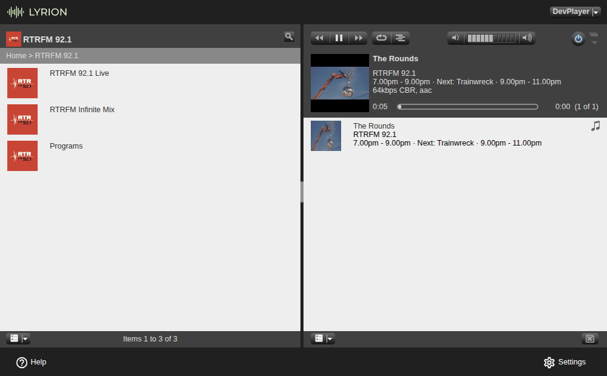
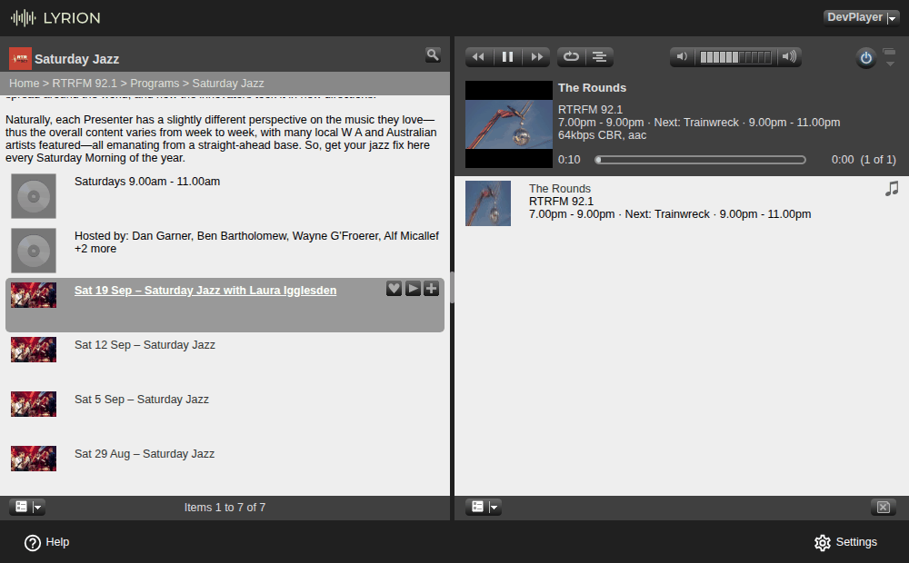
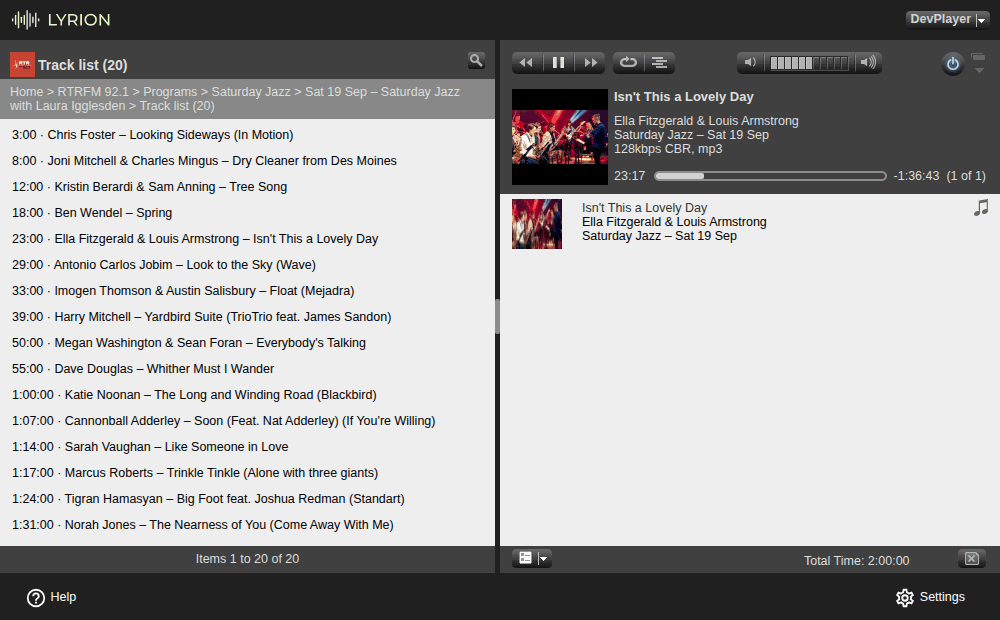

# SqueezeRTRFM

A [Lyrion Music Server](https://lyrion.org/) (LMS, formerly Logitech Media Server) plugin for
[RTRFM 92.1](https://rtrfm.com.au/), Perth's independent community radio station.

## About

The plugin adds **RTRFM 92.1** to the LMS Radio menu. It plays the station's two live streams,
shows what's on air, and lets you browse RTRFM's programs and play any episode from the last
four weeks, with its track list.

## Features

- **Live streams:** **RTRFM 92.1 Live** (the FM simulcast) and **RTRFM Infinite Mix** (RTRFM's
  second stream of non-stop mixes).
- **What's on air:** the live item names the show on air and the next show. While the live
  stream plays, Now Playing shows the show's name, artwork and time slot and the next show,
  and updates when the show changes.
- **Programs:** RTRFM's current line-up with artwork and time slots. Each program has its
  description, schedule, hosts and every episode RTRFM still has audio for (the last 28 days).
- **Episodes:** play, seek and save as favourites. Each episode has its notes and its **track
  list**.
- **Current track:** while an episode plays, Now Playing shows the track playing at that point
  in the show.
- Standard LMS menus, so apps and players that show the LMS Radio menu get the same items
  (tested in the web interface; see [Compatibility](#compatibility)).

## Disclaimer

This is an **unofficial** plugin. It is **not affiliated with RTRFM** or endorsed by the
station. The RTRFM name and logo belong to RTRFM 92.1; they are used here only to identify
the station. For the station itself, visit <https://rtrfm.com.au/>.

## Requirements

- Lyrion Music Server (or Logitech Media Server) **8.0 or later**. Tested on LMS 9.1.x; see
  [Compatibility](#compatibility).
- Internet access from the LMS server to `rtrfm.com.au`, `live.rtrfm.com.au`,
  `restreams.rtrfm.com.au` and `airnet.org.au`.

## Installation

1. In the LMS web interface, open **Settings → Manage Plugins** and scroll down to
   **Additional Repositories**.
2. Paste this URL into the empty field and click **Apply**:

   ```
   https://raw.githubusercontent.com/wilsonwaters/SqueezeRTRFM/main/repo.xml
   ```

3. A new section, **SqueezeRTRFM plugin repository**, appears in the plugin list. Tick
   **RTRFM 92.1** and click **Apply**.
4. LMS asks you to confirm installing a plugin from a third-party repository ("You are about to
   install: … Only install extensions from authors whom you trust. …"). Click **OK**.
5. LMS downloads the plugin, checks it, and says "Changes will take place at the next
   application restart". Restart LMS: click the link in that message, or restart it the way
   you normally do. Then close the settings window (**Close**).
6. Open **Radio → RTRFM 92.1** on any player or in the web interface.

## Usage

Everything is under **Radio → RTRFM 92.1** (in the Default web interface: **Home → Radio →
RTRFM 92.1**). The top level has three items:

| Item | What it is |
|---|---|
| **RTRFM 92.1 Live** | The FM simulcast. Its second line reads "On air: *show* · *time slot*". |
| **RTRFM Infinite Mix** | "Non-stop mixes on RTRFM's second stream". |
| **Programs** | RTRFM's programs. |



### Live streams

Select **RTRFM 92.1 Live** or **RTRFM Infinite Mix** to play it. The "On air" line appears as
the item's second line in menus that show one (Material, players); in the Default web
interface, open the item's details (click its name) to see it, with the show's description and
"Next: *show* · *time slot*".

### Programs and episodes

**Programs** lists RTRFM's current line-up from rtrfm.com.au, A–Z, with each show's artwork and
time slot. (If rtrfm.com.au can't be reached, it lists the programs from RTRFM's Airnet program
guide instead, without artwork.)

Open a program to see, in order:

1. its description;
2. its time slot, e.g. "Saturdays 9.00am - 11.00am";
3. "Hosted by: …";
4. its episodes, newest first, named with their date and title, e.g.
   "Sat 19 Sep – Saturday Jazz with Laura Igglesden".

A program with nothing to play shows "No episodes available in the last 28 days".



Each episode plays straight away from its play button. Open it (click its name) for:

- **Play episode**;
- the episode notes, when the presenter wrote any;
- **Track list (N)**: one row per track, with its approximate time into the show, e.g.
  "23:00 · Ella Fitzgerald & Louis Armstrong – Isn't This a Lovely Day". It says
  "No track list available" when the episode has none, or "Track list not yet available" when
  it has only just aired (see [Now playing & limitations](#now-playing--limitations)).



Episodes can be sought: drag the progress bar in the web interface, or use your player's or
app's seek controls.

### Favourites

Save **RTRFM 92.1 Live**, **RTRFM Infinite Mix** or any **episode** as a favourite with its heart
button (**Save to Favorites**) in the web interface, or your player's or app's "add to
favourites" action. A live favourite plays the stream directly. An episode favourite keeps
working after LMS restarts, until RTRFM removes the audio 28 days after the show; after that it
says "This episode is no longer available".

### Material skin and hardware players

The plugin uses standard LMS menus, so the Material skin, Squeezebox players and apps are
expected to show the same menus with the same names. This hasn't been tested yet (see
[Compatibility](#compatibility)).

## Now playing & limitations

**RTRFM 92.1 Live.** Now Playing shows the show on air as the title, "RTRFM 92.1" as the
artist, the show's artwork, and its time slot and the next show as the album line, e.g.
"5.00pm - 7.00pm · Next: The Rounds · 7.00pm - 9.00pm". It updates by itself about a minute
after each show change. The song info (track info) menu has **Show info**: the show on air,
its description and the next show.

There is **no track-level data for the live streams**: RTRFM publishes which show is on air,
but not which track is playing, so Now Playing never shows live track titles.

**RTRFM Infinite Mix.** Now Playing shows "RTRFM Infinite Mix" and "RTRFM 92.1" with the
station logo; there is no show or track data for this stream.

**Episodes.** Now Playing shows the episode's title, the show and the show's artwork, and the
episode's length. When the episode has a track list, it shows the track playing at that point
in the episode instead: its title and artist, with "*Show* – *date*" as the album line. It
changes by itself at each track boundary and straight after a seek. The track changes come from
the approximate times in the track list, so they can be a little early or late. Song info for
an episode has **Episode notes** (when there are any) and **Track list (N)**.

**What RTRFM's data allows:**

- **Episodes stay available for 28 days.** RTRFM deletes episode audio after four weeks, so
  older episodes aren't listed. Playing one anyway (from a favourite, or a list you opened
  before it expired) shows "This episode is no longer available" and the player stops.
- **New episodes appear about 6 minutes after a show ends**, when RTRFM publishes the audio.
  The plugin lists a just-aired episode about 10 minutes after the show's end, named
  "*date* – *Show*".
- **Episode details and track lists come from Airnet**, RTRFM's program guide, and appear
  later than the audio: sometimes within a few hours, sometimes not until the next day. Until
  then a just-aired episode has no notes, and instead of its track list it says
  "Track list not yet available". Presenters sometimes edit a track list after the show.
- **Older episodes of daily shows are found from their regular weekly time slots**, which the
  plugin works out from the show's recent episodes. A weekday on which a show appeared only
  once in its recent episodes (say, an occasional extra Tuesday) may not be listed for older
  weeks, even though RTRFM still has that audio.
- **Episodes whose audio is gone are hidden.** If RTRFM can't be asked, the episode stays in
  the list with "· Availability unknown" added to its second line.
- **Opening a program for the first time can take several seconds** (about 8–12 s on a slow
  connection), while the plugin loads the show's page and checks which episodes still have
  audio. The results are cached (the show page and the checks for up to 24 hours), so later
  opens are quick.
- The **Programs** list is cached for up to a day, so a change in RTRFM's line-up can take that
  long to show.

## Troubleshooting

**a. RTRFM 92.1 isn't in the Radio menu after installing.** LMS only installs a plugin when it
restarts, so restart LMS. Then open **Settings → Manage Plugins** and check that RTRFM 92.1 is
listed as installed and ticked. If it isn't there, install it again (see
[Installation](#installation)); if it is, look for `RTRFM` errors in the server log (see e).

**b. The live stream won't play on an older hardware player.** The live streams are HE-AAC.
Players that can't decode AAC themselves need LMS to convert it with `faad`: open **Settings →
Advanced → File Types** and make sure the AAC conversions that use `faad` are enabled, then try
again. (Episodes are MP3, which every player plays.)

**c. "This episode is no longer available".** RTRFM deletes episode audio 28 days after the
show, and this episode's audio has gone. It happens with older favourites, or with a list you
opened before the audio expired. There's nothing to fix. "Couldn't reach RTRFM to play this
episode" is different: RTRFM's audio server didn't answer, so try again later.

**d. Programs is empty, or shows an error item** such as
"Couldn't load from RTRFM – please try again later", or the RTRFM 92.1 menu shows
"Sorry, part of the RTRFM menu could not be loaded. Please try again later.". The RTRFM website
or its program guide (Airnet) is temporarily unavailable, or your server can't reach it. Try
again later; the live streams usually still play.

**e. Anything else: turn on debug logging and report it.**

1. Open **Settings → Advanced → Logging**, set **(plugin.rtrfm) - RTRFM 92.1** to **Debug** and
   click **Apply**. Or send the JSON-RPC command `["debug","plugin.rtrfm","DEBUG"]`:

   ```bash
   curl -s -H 'Content-Type: application/json' \
     -d '{"id":1,"method":"slim.request","params":["",["debug","plugin.rtrfm","DEBUG"]]}' \
     http://<your-lms>:9000/jsonrpc.js
   ```

2. Reproduce the problem.
3. Open the server log (the `server.log` link on the same Logging page) and copy the lines
   mentioning `RTRFM` from around that time.
4. Open an issue at <https://github.com/wilsonwaters/SqueezeRTRFM/issues> with what you did,
   what happened, your LMS version and those log lines.
5. Set the level back to **Warn** afterwards.

**f. Run the self-test.** `scripts/smoke.sh` checks the whole plugin on your server in about
a minute and says which part fails; see [Self-test](#self-test).

## Compatibility

- **Tested** on LMS **9.1.x** (9.1.1) with the Default web interface and a squeezelite player.
- **Declared** for LMS **8.0 or later** (`install.xml`), but not tested on 8.x.
- **Expected to work, untested:** the Material skin, Squeezebox hardware players and other
  controllers and apps. They show the same standard LMS menus.
- The live streams are HE-AAC; see troubleshooting item b for players without AAC support.

## Self-test

`scripts/smoke.sh` is a one-command acceptance test for a running LMS. It talks to LMS over
JSON-RPC and checks, in order: the server answers; the player is connected; the plugin is
enabled; the Radio menu lists RTRFM; the top level has RTRFM 92.1 Live, RTRFM Infinite Mix and
Programs; the live stream plays; Programs isn't empty; an episode plays and seeks; an episode
has a track list. It prints one PASS or FAIL line per check, then `SMOKE: <passed>/9 passed`.

> **Warning:** the test plays audio on the player you choose and replaces its queue. At the
> end, also if it fails or you press Ctrl-C, it stops the player, clears the queue and switches
> the player off again if it was off. Run it on a player nobody is listening to.

It needs bash 4 or later, `curl` and `jq` (on Debian, Ubuntu or Raspberry Pi OS:
`sudo apt install curl jq`), on any computer that can reach your LMS:

```bash
git clone https://github.com/wilsonwaters/SqueezeRTRFM.git
cd SqueezeRTRFM
scripts/smoke.sh http://<your-lms>:9000 <player-mac>
```

- `<player-mac>` is the player's MAC address, shown under **Settings → Information**. It can
  be left out if only one player is connected.
- For a password-protected server, set `LMS_USER` and `LMS_PASS`. `LMS_URL` and `PLAYER` can
  be used instead of the arguments. `scripts/smoke.sh --help` lists every option.
- It exits with 0 when all checks pass, 1 when a check fails, and 2 when it can't run (bad
  arguments, `curl` or `jq` missing, LMS unreachable, unknown player).
- It takes about a minute; opening programs for the first time can make it slower.

## Updating

When a new version is released, **Settings → Manage Plugins** shows an update notice for
RTRFM 92.1: tick it, click **Apply**, and restart LMS. If you have turned on automatic plugin
updates on that page, LMS installs new versions by itself and only needs a restart. The
changes in each version are listed in [CHANGELOG.md](CHANGELOG.md).

## Uninstalling

1. In **Settings → Manage Plugins**, untick **RTRFM 92.1** and click **Apply**.
2. Restart LMS when prompted.
3. Optionally, delete the repository URL from **Additional Repositories** and click **Apply**
   again.

## Manual installation

If your server can't use the repository (for example, it has no internet access):

1. Download `RTRFM-<version>.zip` from the
   [Releases page](https://github.com/wilsonwaters/SqueezeRTRFM/releases).
2. Create a folder named `RTRFM` in your LMS `Plugins` folder and extract the zip into it,
   so that `install.xml` ends up at `Plugins/RTRFM/install.xml`. Common locations:
   - Debian, Ubuntu and Raspberry Pi OS packages: `/usr/share/squeezeboxserver/Plugins/`
   - Red Hat, Fedora and similar packages: `/usr/share/lyrionmusicserver/Plugins/`
   - Docker (official image) and piCorePlayer: the `Plugins` folder in the LMS cache folder,
     e.g. `/config/cache/Plugins/` in Docker

   **Settings → Information** lists your server's plugin folders.
3. Restart LMS.

Don't install the plugin both manually and from the repository: remove the manual copy
first if you switch to the repository.

## Development

- `scripts/check.sh` runs every check: compile check, unit tests (`prove`), XML validation,
  strings lint, package checks and shellcheck. CI runs the same script on every pull request.
- `scripts/build.sh` builds `dist/RTRFM-<version>.zip` and its `.sha1` from `RTRFM/`.
- `scripts/lms-repo-install.sh` installs the plugin on an LMS from a repository URL without a
  browser (used for testing).
- `scripts/smoke.sh` is the acceptance test described in [Self-test](#self-test).
- Releases are automated: see [RELEASING.md](RELEASING.md). Update [CHANGELOG.md](CHANGELOG.md)
  first.
- [docs/official-repository.md](docs/official-repository.md) describes how the plugin could be
  listed in the official LMS plugin repository.

## License

[Apache License 2.0](LICENSE).
