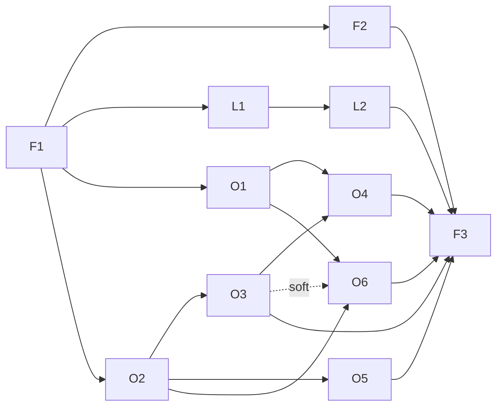

# Streams — SqueezeRTRFM

_Stream decomposition. Drafted 2026-09-26 by the stream-planning sub-agent from `brief.md`, `research/rtrfm-api.md`,
`research/lms-plugin-architecture.md`, `OPEN-QUESTIONS.md`; accepted by the orchestrator. Status: planned → in progress → done._

| Stream | Outcome | Capabilities | Cross-stream deps | Size | Status |
|---|---|---|---|---|---|
| **foundation** | Anyone can install RTRFM from one repository URL; every change is tested in CI; releases are built reproducibly by automation. | Installable skeleton (`install.xml`, `Plugin.pm` OPMLBased tag `rtrfm` menu `radios`, strings, icon); frozen init/menu hook API for other streams; shared `HTTP.pm` (Cloudflare-safe UA, JSON, caching) and `Util.pm` (Perth time helpers, episode-URL contract, episode-metadata cache contract); unit-test harness with stubbed `Slim::`; `scripts/check.sh` + CI; zip+sha1 build; `repo.xml`; GitHub Actions release workflow (creates tag + Release, updates repo.xml); README/docs; JSON-RPC acceptance smoke test. | Provides hooks/helpers/harness to live + ondemand; F3 depends on all shipping tasks. | M (3 tasks) | done |
| **live** | RTRFM live streams play from the Radio menu with the current on-air show shown as "now playing". | FM simulcast (stream1) + Infinite Mix (stream2) items; "On air / Next" lines; stream-URL discovery w/ fallback; RemoteMetadata provider polling `get_current_and_next_show` (show name, artwork, slot, next show). | Needs F1 | S (2 tasks) | done |
| **ondemand** | Users browse Programs → Episodes, play any retained episode (28 days; seekable; favourites work) and see its track list. | `rtrfm://` protocol handler resolving signed rzz MP3 at play time; Airnet program/episode browse; tracklist submenu; current track during episode playback; rtrfm.com.au artwork/descriptions/line-up; stretch: full 28-day window + availability check. | Needs F1 (incl. `rtrfm` handler registration stub, Util.pm contracts) | L (6 tasks) | done |

Not streams: `dev/` (local LMS 9.1.1 + squeezelite "DevPlayer" test bed — dev-env agent) and `ai-state/` (orchestrator).

## Success criteria → tasks

| # | Brief criterion | Delivered by | Verified at |
|---|---|---|---|
| 1 | Live stream plays audio | F1 (playable stream1 item); L1 (both streams, URL discovery) | F1, L1 runtime |
| 2 | Web UI lists programs/episodes; selecting plays | O2 (browse) + O1 (playback) | IC-1 |
| 3 | Track listings visible (bonus: live now-playing) | O3 (tracklists); L2 (live show now-playing); O4 (current track in episode) | IC-2, L2, O4 |
| 4 | Install via repository URL | F2 (pipeline, repo.xml, v0.1.0, local repo-install test); F3 (v1.0.0 from GitHub URL on clean LMS) | F2, IC-3, F3 |
| 5 | Automated tests + independent review + runtime verification | F1 (harness + CI); every task (tests, review agent, runtime); F3 (scripted smoke test) | every PR; F3 |

## Dependency graph

Integration checkpoints (run by the orchestrator's runtime-verification agent, not tasks):
- **IC-1** (after O1 + O2): web UI browse → play episode, seek, favourite replay → criterion 2.
- **IC-2** (after O3): track lists visible in menu → criterion 3.
- **IC-3** (after F2 + IC-1): cut v0.2.0 via the release workflow; install from raw GitHub `repo.xml` on a clean LMS profile → criterion 4 preview (stakeholder may try on pi14).

| Wave | Tasks (parallel) | Starts when |
|---|---|---|
| 0 | F1 | now |
| 1 | F2, L1, O1, O2 | F1 merged |
| 2 | L2, O3, O5 | L1 / O2 merged |
| 3 | O4, O6 | O1+O3 / O1+O2(+O3) merged |
| 4 | F3 | all shipping tasks merged |

Critical path: F1 → O2 → O3 → O4 → F3. Core criteria 1, 2, 4 are met after wave 1 + IC-1 + IC-3.

Priority / descope order: **Must** F1, O1, O2, F2, L1, O3, F3 · **Should** L2, O5 · **Could** O4 · **Stretch** O6 (cut O6, then O4, then O5 if needed).

## Parallel-work rules (file-conflict mitigation)

1. **`Plugin.pm` is frozen after F1.** Hook API: `initPlugin` calls `Plugins::RTRFM::Live->init()` and
   `Plugins::RTRFM::OnDemand->init()`; the top-level feed calls async `Live->menuItems($client, $cb, $args)` then
   `OnDemand->menuItems(...)` and concatenates (live first). Each hook must call `$cb->(\@items)` exactly once, even on
   error. Streams never edit `Plugin.pm` (orchestrator sign-off needed).
2. **`strings.txt`**: F1 creates comment-delimited sections per task (`# === L1 ===` … `# === O6 ===`) and pre-seeds all
   tokens named in the master plans; a task edits only inside its own section.
3. **`install.xml` `<version>`** changes only in orchestrator release commits (the release workflow triggers on it).
4. **README.md, repo.xml, scripts/, .github/, docs/, CHANGELOG.md** belong to foundation. Feature tasks describe
   user-visible changes in their PR body; F3 folds them into docs.
5. **Tests**: prefixes `t/1x-*` foundation, `t/2x-*` live, `t/3x-*` ondemand; fixtures in
   `t/data/{foundation,live,ondemand}/`; F1's `t/lib` stubs cover all Slim APIs named in the plans; later tasks may add
   stub files, changes to existing stubs are additive only; `prove`/CI never touch the network.
6. **`OnDemand.pm` builder ownership**: O2 creates `_programsFeed`, `_programItem`, `_episodesFeed`, `_episodeItem`;
   afterwards O3 owns `_episodeItem` + episode submenu, O5 owns `_programsFeed`/`_programItem`/program header, O6 owns
   `_episodesFeed`. Second-to-merge rebases.

| Path | Created by | Owner afterwards | Rule |
|---|---|---|---|
| `RTRFM/Plugin.pm` | F1 | foundation | frozen |
| `RTRFM/install.xml` | F1 | foundation | version only in release commits |
| `RTRFM/strings.txt` | F1 | shared | own section only |
| `RTRFM/HTTP.pm`, `RTRFM/Util.pm` | F1 | foundation | append-only if unavoidable; flag in PR |
| `RTRFM/HTML/EN/plugins/RTRFM/**` | F1 | foundation | – |
| `RTRFM/Live.pm` | F1 (stub) | live (L1 rewrites) | – |
| `RTRFM/NowPlaying.pm`, `RTRFM/LiveMetadata.pm` | L1, L2 | live | – |
| `RTRFM/OnDemand.pm` | F1 (stub) | ondemand (O2 rewrites; builders per rule 6) | – |
| `RTRFM/ProtocolHandler.pm` | F1 (stub) | ondemand (O1 writes, O4 extends) | – |
| `RTRFM/Restream.pm`, `Airnet.pm`, `Tracklist.pm`, `Shows.pm` | O1, O2, O3, O5 | ondemand | – |
| `t/lib/**` | F1 | foundation | new files freely; existing additive only |
| `scripts/`, `.github/`, `repo.xml`, `README.md`, `RELEASING.md`, `docs/`, `CHANGELOG.md` | F1/F2/F3 | foundation | features don't edit |
| `dev/` | dev-env agent | orchestrator | changes via orchestrator |

## Shared resources & conventions

- **Runtime test bed**: one LMS 9.1.1 at http://localhost:9000 + DevPlayer (`00:00:00:00:00:01`) — see `RUNBOOK.md`.
  Only one agent may use it at a time: acquire the test-bed lock (`dev/testbed-lock.sh`), point
  `$LMS_HOME/Plugins/RTRFM` at your worktree (`PLUGIN_SRC=<worktree>/RTRFM dev/link-plugin.sh --restart`), verify,
  then re-link the main checkout and release the lock. F2/F3 repo-install tests remove the dev link first.
- **GitHub releases** are cut only by the release workflow (tags can't be pushed from the container); the orchestrator
  triggers `workflow_dispatch` via GitHub MCP or merges a version-bump commit. Cadence: v0.1.0 after F2, v0.2.0 at
  IC-3, v1.0.0 in F3.
- **Branches/PRs**: `feat/<ID>-<slug>`, one PR per task; `scripts/check.sh` green before review.
- **RTRFM endpoints** are unofficial: cache plugin-side; never send a `libwww-perl/*` User-Agent (Cloudflare 403).

## Changelog
- 2026-09-26 — Initial decomposition (stream-planning sub-agent); accepted by orchestrator with test-bed lock convention added.
- 2026-09-26 — All streams done: 11/11 tasks merged, v1.0.0 released, final system verification passed. Follow-up #22 open (optional).
